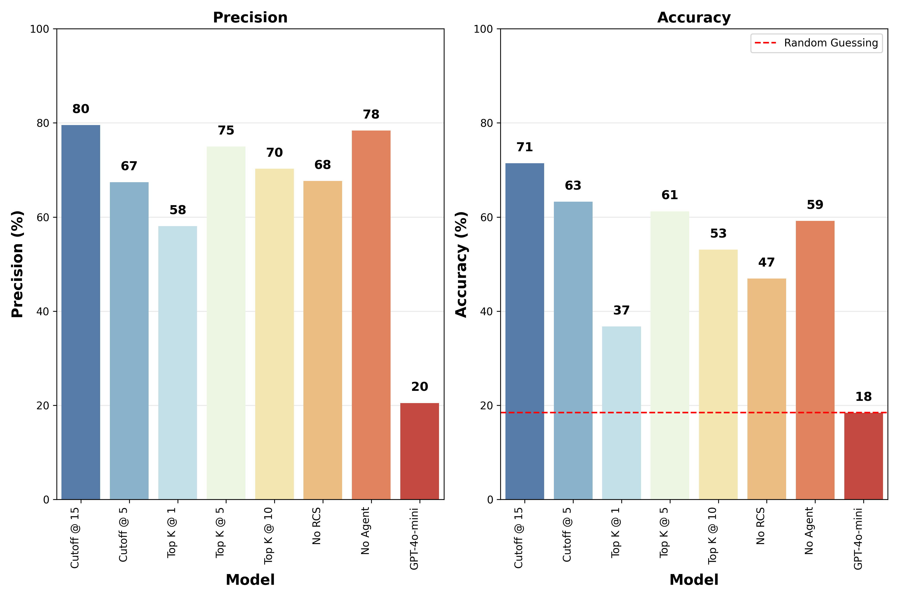
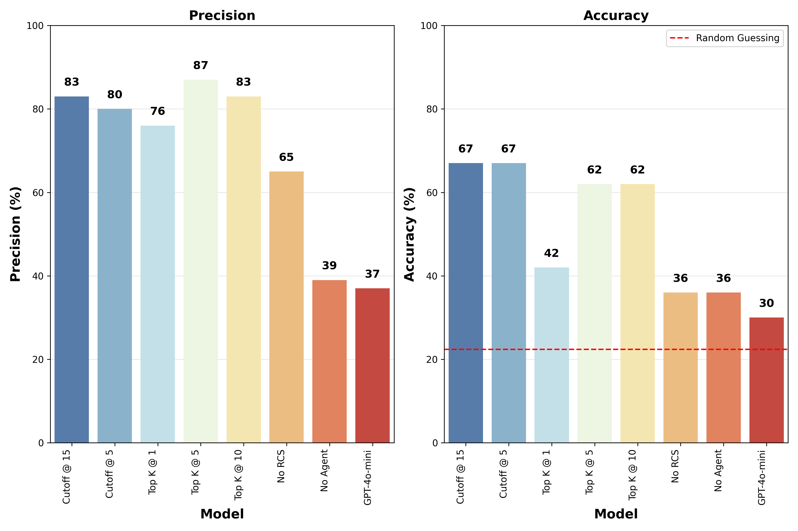
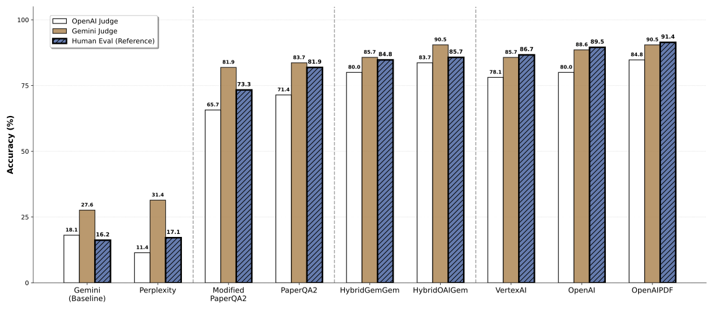

# Superhuman Synthesis of Scientific Knowledge with LLM Agents
This repository contains the code and data for "Superhuman Synthesis of Scientific Knowledge with LLM Agents", a comprehensive study that reproduces and extends the PaperQA2 framework for scientific literature synthesis across multiple domains.

## Overview
Our research addresses a fundamental question: Can AI achievements in scientific literature synthesis generalize across different scientific domains, or do different fields require fundamentally different approaches?

## Key Findings
* **Successfully reproduced PaperQA2** achieving 71% accuracy on LitQA2 biology benchmark
* **Critical train/test performance gap**: GPT-4o-mini baseline shows 40% accuracy drop from train (30%) to test (18%), highlighting the importance of RAG for recent literature
* **Domain-specific optimization** is crucial: Commercial systems (OpenAI Assistant: 91.4%, VertexAI: 86.7%) significantly outperformed PaperQA2 (81.9%) on astronomical tasks
* **Cost-performance insights**: VertexAI optimal for cost-conscious applications (13.3× cost advantage)

<div align="center">
  
  <p><em>PaperQA2 Performance on Test Dataset</em></p>
</div>

<div align="center">
  
  <p><em>PaperQA2 Performance on Training Dataset</em></p>
</div>

<div align="center">
  
  <p><em>Performance comparison of SciRag Agents across three evaluation methods showing four distinct performance tiers.</em></p>
</div>

## Repository Structure

```
xx823/
├── data/                          # Research datasets and documents
│   ├── cosmopaperqa_paper/       # Cosmology research papers (6 PDFs)
│   │   ├── 1604.01424v3.pdf      # CAMELS simulations
│   │   ├── 1807.06209v4.pdf      # IllustrisTNG project
│   │   ├── 2010.00619v2.pdf      # SIMBA simulations
│   │   └── ...                   # Additional cosmology papers
│   ├── cosmospaperqa/            # Cosmology dataset in parquet format
│   │   └── CosmoPaperQA.parquet  # Structured question-answer pairs
│   ├── LitQA2_pdfs/              # Literature QA dataset (150+ PDFs)
│   │   ├── 1-s2.0-*.pdf          # Scientific papers from various journals
│   │   ├── science.*.pdf         # Science journal papers
│   │   ├── s41586-*.pdf          # Nature journal papers
│   │   └── 2024.*.pdf            # bioRxiv preprints
│   ├── ocr_output/               # OCR-processed text files
│   │   ├── 1604.01424v3.txt      # Text extracted via OCR
│   │   └── ...                   # Corresponding text files
│   ├── papers/                   # Extended paper collection (40+ papers)
│   │   └── *.pdf                 # Additional scientific papers
│   └── Questions/                # Question datasets
│       ├── formatted_questions/   # Training question sets
│       └── formatted_questions_test/ # Test question sets
├── notebooks/                     # Jupyter notebooks for analysis
│   ├── cosmo_eval.ipynb          # Cosmology evaluation pipeline
│   ├── MC_pipeline.ipynb         # Multiple choice question pipeline
│   ├── MC_eval_no_agent.ipynb    # Non-agent MC evaluation
│   ├── ocr_embedding_eval.ipynb  # OCR vs PDF embedding comparison
│   ├── reproduction_eval.ipynb   # Reproduction study evaluation
│   └── results/                  # Performance visualizations
│       ├── paperqa2_performance.png
│       ├── chunk_size.png
│       ├── cost_efficiency.png
│       └── ...                   # Additional result charts
├── scirag/                       # Main SciRAG package
│   ├── scirag/                   # Core implementation modules
│   │   ├── scirag_openai.py      # OpenAI RAG implementation
│   │   ├── scirag_gemini.py      # Google Gemini RAG
│   │   ├── scirag_paperqa2.py    # PaperQA2 integration & reproduction
│   │   ├── scirag_vertexai.py    # Vertex AI RAG
│   │   ├── scirag_hybrid.py      # Hybrid OCR+PDF approach
│   │   ├── scirag_perplexity.py  # Perplexity integration
│   │   ├── ocr.py                # OCR processing utilities
│   │   ├── dataset.py            # Dataset handling
│   │   └── scirag_evaluator.py   # Evaluation framework
│   ├── notebooks/                # Platform-specific experiments
│   │   ├── scirag_openai.ipynb   # OpenAI experiments
│   │   ├── scirag_gemini.ipynb   # Gemini experiments
│   │   ├── scirag_paperqa2.ipynb # PaperQA2 reproduction experiments
│   │   ├── eval.ipynb            # General evaluation
│   │   ├── human_eval.ipynb      # Human evaluation interface
│   │   └── ai_eval.ipynb         # AI-based evaluation
│   ├── results/                  # Comprehensive evaluation results
│   │   ├── cost_efficiency.pdf   # Cost analysis across platforms
│   │   ├── rag_results.pdf       # Performance comparison summary
│   │   ├── marks/                # Human evaluation scores (100+ files)
│   │   └── *.pkl                 # Serialized result objects
│   ├── embeddings/               # Pre-computed embeddings
│   │   ├── openai_text-embedding-3-large_embeddings.npy
│   │   └── gemini_gemini-embedding-001_embeddings.npy
│   ├── markdowns/                # Markdown-converted papers
│   │   ├── 1604.01424v3.md       # Converted cosmology papers
│   │   └── ...                   # Additional markdown versions
│   └── txt_files/                # OCR-processed text files
│       ├── 1604.01424v3.txt      # Plain text versions
│       └── ...                   # Additional text files
├── Reproduction/                  # PaperQA2 Reproduction Studies
│   ├── Inspect_AI/               # AI inspection framework
│   │   ├── eval_pipeline.py      # Main evaluation pipeline
│   │   ├── eval_pipeline_no_agent.py # Non-agent evaluation
│   │   ├── metrics.py            # Evaluation metrics
│   │   ├── scorer.py             # Scoring functions
│   │   └── logs/                 # Extensive evaluation logs (50+ files)
│   │       └── *.eval            # Timestamped evaluation results
│   └── grader.log                # Grading system logs
├── reports/                      # Research documentation
│   ├── Master_Report.pdf         # Comprehensive research report
│   └── Executive_Summary.pdf     # Executive summary
├── tests/                        # Testing framework
│   └── SimpleAgent_test.ipynb    # Agent testing notebook
├── requirements.txt              # Python dependencies
├── project.toml                  # Project configuration
└── README.md               # Project setup instructions
```

## Quick Start
### Prerequisites

* Python 3.8+
* Access to OpenAI API, Google Gemini API, or VertexAI
* Required API keys set as environment variables

### Installation
```
git clone git@gitlab.developers.cam.ac.uk:phy/data-intensive-science-mphil/assessments/projects/xx823.git
cd xx823
# Install dependencies
pip install -r requirements.txt
```

### Environment Setup
```
# Create a .env file with your API keys:
bashOPENAI_API_KEY=your_openai_key
GOOGLE_API_KEY=your_gemini_key
VERTEX_AI_PROJECT_ID=your_project_id
```

### Key Datasets
1. LitQA2 (Biology Domain)
* 248 multiple-choice questions from biology literature
* Used for PaperQA2 reproduction validation
* Training: 199 questions (2000-2024 papers) | Test: 49 questions (2024 papers only)
2. CosmoPaperQA2 (Astronomy Domain)
* 105 expert-curated cosmology questions
* Derived from 5 influential papers spanning:

### Running Experiments

#### PaperQA2 Reproduction
```bash
# Basic reproduction with default parameters
inspect eval eval_pipeline.py --max-connections=1
```

#### SciRAG Multi-Backend Evaluation
```bash
cd scirag
# Follow detailed instructions in the SciRAG documentation
```
[SciRAG Documentation](scirag/README.md)

#### Customizing PaperQA2 Parameters

**IMPORTANT**: Parameters must be manually edited in `eval_pipeline.py` before running experiments.

**Key Parameters to Modify in `eval_pipeline.py`:**

1. **Evidence and Resource Settings** (Lines 85-95):
```python
# In the Settings configuration:
answer=AnswerSettings(
    evidence_k=30,                    # Change this: Number of evidence pieces (1, 5, 10, 15, 30)
    answer_max_sources=15,            # Change this: Max sources per question (5, 15)
    evidence_skip_summary=False       # Change this: Skip evidence summarization
)
```

2. **Model Configuration** (Lines 70-85):
```python
settings = Settings(
    llm="gpt-4o-mini",               # Change this: "gpt-4o-mini", "gpt-4o", "gpt-4.1"
    summary_llm="gpt-4o-mini",       # Change this: Summary agent model
    agent=AgentSettings(
        agent_llm="gpt-4o-mini",     # Change this: Search agent model
    )
)
```

3. **Chunking Strategy** (Lines 96-100):
```python
chunking=ParsingSettings(
    chunk_size=5000,                 # Change this: 3000, 4000, 5000, 6000
    overlap=50                       # Change this: 50, 100, 250, 300, 500
)
```

4. **Embedding Model** (Line 101):
```python
embedding="text-embedding-3-small"  # Change this: "text-embedding-3-small", "text-embedding-3-large"
```

5. **Task Parameters** (Lines 245-252):
```python
@task(parameters={
    "model": "gpt-4o-mini",         # Change this: Model identifier
    "evidence_k": 30,               # Change this: Must match AnswerSettings
    "max_sources": 15,              # Change this: Must match AnswerSettings
    "skip_summary": False,          # Change this: Must match AnswerSettings
    "dataset": "test"               # Change this: "test" or "train"
})
```

#### Example Ablation Study Configurations

**Study 1: Evidence Depth Analysis**
```python
# Configuration for evidence_k=1
answer=AnswerSettings(evidence_k=1, answer_max_sources=15, evidence_skip_summary=False)

# Configuration for evidence_k=5  
answer=AnswerSettings(evidence_k=5, answer_max_sources=15, evidence_skip_summary=False)

# Configuration for evidence_k=10
answer=AnswerSettings(evidence_k=10, answer_max_sources=15, evidence_skip_summary=False)
```

**Study 2: Model Component Analysis**
```python
# All GPT-4o configuration
settings = Settings(
    llm="gpt-4o",
    summary_llm="gpt-4o", 
    agent=AgentSettings(agent_llm="gpt-4o")
)

# Search agent only GPT-4o
settings = Settings(
    llm="gpt-4o-mini",
    summary_llm="gpt-4o-mini",
    agent=AgentSettings(agent_llm="gpt-4o")  # Only search agent upgraded
)
```

**Study 3: Chunking Strategy Optimization**
```python
# Large chunks with minimal overlap
chunking=ParsingSettings(chunk_size=6000, overlap=50)

# Small chunks with high overlap  
chunking=ParsingSettings(chunk_size=3000, overlap=500)

# Optimal configuration (from results)
chunking=ParsingSettings(chunk_size=5000, overlap=250)
```

**Study 4: Architecture Ablations**
```python
# Disable RCS (Retrieval Citation System) - requires code modification
# Comment out RCS-related functionality in the agent

# Disable Agent Architecture - use non-agent version
# Use eval_pipeline_no_agent.py instead
```

#### Running Different Configurations

1. **Edit the parameters** in `eval_pipeline.py`
2. **Run the evaluation**:
```bash
inspect eval eval_pipeline.py --max-connections=1
```
3. **Check results** in `logs/` directory
4. **Modify parameters** for next experiment
5. **Repeat** for systematic ablation

#### Dataset Selection

**For Training Data:**
```python
# Change the questions file path (Line 32)
QUESTIONS_FILE = os.path.join(PROJECT_ROOT, 'data', 'Questions', 'formatted_questions', 'questions.jsonl')
```

**For Test Data (default):**
```python
QUESTIONS_FILE = os.path.join(PROJECT_ROOT, 'data', 'Questions', 'formatted_questions_test', 'questions.jsonl')
```

**Important Notes:**
- Always ensure sufficient OpenAI API quota before starting experiments
- Index building (e.g. `pqa_index_c3f8bdfb1d2ee63a434cf2e3b10a491f`) happens automatically on first run
- Results are logged with timestamps in `Reproduction/Inspect_AI/logs/`
- Each parameter change requires manual code editing and re-running the evaluation


#### Reproduction Results Analysis
After running experiments, analyze your results using the provided notebooks:

```bash
# For PaperQA2 reproduction analysis
jupyter notebook notebooks/reproduction_eval.ipynb

# For PaperQA2 demo
jupyter notebook notebooks/Multiple_Choice_Evaluation_2a.ipynb
```


  
### TroubleShooting
#### 1. PaperQA2 Index Building Issues
**Problem**: Index building fails or takes extremely long
```bash
# Error: "Failed to build index" or timeout errors
```

**Solutions**:
- **Ensure sufficient OpenAI API quota**: Index building requires significant API calls for embeddings
- **Check API rate limits**: Reduce `--max-connections` parameter if hitting rate limits
- **Retry mechanism**: The system has built-in retry logic, but you may need to restart manually
- **Monitor progress**: Use verbose logging to track index building progress
```bash
inspect eval eval_pipeline.py --max-connections=1 --verbose
```
#### 2. API Quota and Rate Limiting
**Critical**: Ensure you have sufficient OpenAI API quota before starting experiments!

**Check your quota**:
```bash
# Monitor your API usage at: https://platform.openai.com/usage
# Recommended minimum quota: $50 for full reproduction
```

#### 3. Crached PaperQA2 Index
```
rm -rf /Users/apple/.pqa/indexes/* # romove all built index, and rerun the code again
inspect eval eval_pipeline.py --max-connections=1
```

#### 4. Common Error Messages and Solutions

| Error | Solution |
|-------|----------|
| `RateLimitError` | Reduce `--max-connections` to 1, check API quota |
| `TimeoutError` | Increase timeout values, check internet connection |
| `IndexBuildError` | Clear cache, ensure sufficient disk space, retry |
| `APIConnectionError` | Check API keys, verify network connectivity |
| `QuotaExceededError` | **Add funds to OpenAI account, wait for quota reset** 

## Key Components
Reproduction Study

1. PaperQA2 Implementation: Using open-source package from FutureHouse Inc.
2. Systematic Ablation: RCS component, agentic architecture, model variations
3. Parameter Optimization: Chunking strategies, evidence integration depth

Extension to Astronomy

1. SciRag Development: Comprehensive testing framework for astronomy
2. CosmoPaperQA2 Creation: 105 expert-curated questions from influential papers
3. Multi-System Evaluation: 8 distinct RAG configurations
4. Domain Expert Assessment: 945 expert evaluations (9 systems × 105 questions)

## Documentation
Our project includes comprehensive documentation built with Sphinx, covering all aspects of the SciRAG framework and PaperQA2 reproduction study.
``` bash
sphinx-build -b html docs docs/_build/html
open docs/_build/html/index.html 
```
## Contributing
We welcome contributions! Please see our Contributing Guidelines for details.

##  License
This project is licensed under the MIT License - see the LICENSE file for details.

## Contact
Xueqing Xu
Department of Physics, University of Cambridge
📧 xx823@cam.ac.uk

## Related Links:
- **PaperQA2 Original Repository**: [https://github.com/Future-House/paper-qa](https://github.com/Future-House/paper-qa)
- **SciRAG Repository**: [https://github.com/CMBAgents/scirag.git](https://github.com/CMBAgents/scirag.git)
- **CosmoPaperQA2 Dataset**: [https://huggingface.co/datasets/ASTROANTS/CosmoPaperQA/viewer](https://huggingface.co/datasets/ASTROANTS/CosmoPaperQA/viewer)
- **LitQA2 Training Dataset**: [https://huggingface.co/datasets/futurehouse/lab-bench/viewer/LitQA2?views%5B%5D=litqa2](https://huggingface.co/datasets/futurehouse/lab-bench/viewer/LitQA2?views%5B%5D=litqa2)
- **LitQA2 Test Dataset**: [https://huggingface.co/datasets/futurehouse/aviary-paper-data](https://huggingface.co/datasets/futurehouse/aviary-paper-data)
