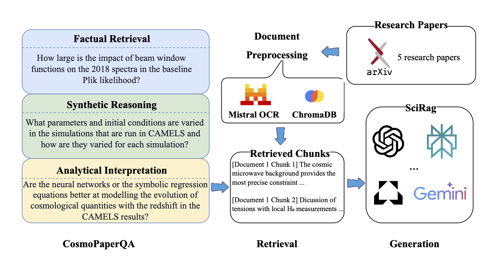

# SciRAG: Scientific Retrieval-Augmented Generation Research Project

A comprehensive research framework for evaluating Retrieval-Augmented Generation (RAG) systems on scientific literature, with particular focus on cosmology and astrophysics papers. This project compares multiple RAG approaches including traditional PDF processing, OCR-enhanced text extraction, and various AI platforms.

##  Overview
SciRAG is a comprehensive retrieval-augmented generation (RAG) system specifically designed for scientific research tasks. It combines multiple AI backends with sophisticated document processing and evaluation capabilities to provide accurate, well-sourced answers to scientific questions. We have submitted the work on Scirag to ICML Astrophysics Workshop, and waiting for their response. This astronomical extension work has been accepted at the ICML 2025 Workshop on Machine Learning for Astrophysics. 


## AI Declaration
GitHub Copilot was used during development to assist with code completion, function documentation, debugging, and refactoring suggestions. All AI-generated code underwent thorough review to ensure correctness, adherence to project requirements, and proper error handling. The core algorithms and methodological decisions remain my intellectual contribution, with Copilot serving only as a productivity tool for implementing standard techniques and reducing time spent on repetitive coding tasks.

<div align="center">
  
  <p><em>Scirag Overview</em></p>
</div>

### Key Features
* **Multiple AI Backends**: OpenAI GPT-4, Google Gemini, Vertex AI, Perplexity, and more
* **Advanced Document Processing**: Support for PDFs, scientific papers, and various document formats
* **Hybrid RAG Systems**: Combine multiple embeddings and retrieval strategies
* **Comprehensive Evaluation**: Built-in human and AI evaluation frameworks
* **Cost Analysis**: Track and optimize API costs across different providers
* **Scientific Focus**: Optimized for academic papers, research documents, and scientific queries

## Install dependencies
```
pip install -e .
```

## Configure API keys
Create a .env file in the root directory:
```
OPENAI_API_KEY=your_openai_api_key_here
GOOGLE_API_KEY=your_google_api_key_here
MISTRAL_API_KEY=your_mistral_api_key_here
PERPLEXITY_API_KEY=your_perplexity_api_key_here
```

## Quick Start
OCR Processing
```
from scirag import MistralOCRProcessor

processor = MistralOCRProcessor()
result = processor.process_pdf(
    pdf_path="../pdfs/2201.02202v1.pdf",
    save_markdown=True,
    output_dir="../markdowns"
)
```
OpenAI RAG System
```
import os
from dotenv import load_dotenv
from scirag import SciRagDataSet

load_dotenv()
api_key = os.environ.get("OPENAI_API_KEY")

# Initialize OpenAI RAG
from scirag import SciRagOpenAI
scirag = SciRagOpenAI(openai_api_key=api_key)

# Load dataset and ask questions
dataset = SciRagDataSet()
qa = dataset.load_dataset()

# Ask a question
qid = 4
question = qa['question'].iloc[qid]
response = scirag.get_response(question)
print(response)
```

Gemini RAG System 
```
import os
from dotenv import load_dotenv
from scirag import SciRagDataSet
load_dotenv()
os.environ["GOOGLE_APPLICATION_CREDENTIALS"] = "gemini.json"

from scirag import SciRagHybrid
scirag = SciRagHybrid(
    google_api_key=os.environ.get("GOOGLE_API_KEY")
)

# Load dataset and ask questions
dataset = SciRagDataSet()
qa = dataset.load_dataset()

# Create vector database and query
scirag.create_vector_db()
# Ask a question
qid = 4
question = qa['question'].iloc[qid]
response = scirag.get_response(question)
print(response)
```
Vertex AI
```
from scirag import SciRagVertexAI
scirag = SciRagVertexAI()
from scirag import SciRagDataSet

# Enhanced query processing
question = "How large is the impact of beam window functions on the 2018 spectra?"
enhanced_question = scirag.enhanced_query(question)
response = scirag.get_response(question)
```
PaperQA2 Integration
```
from scirag import SciRagPaperQA2
paperqa = SciRagPaperQA2()

# Load dataset and ask questions
dataset = SciRagDataSet()
qa = dataset.load_dataset()

#ask a question
qid = 4
question = qa['question'].iloc[qid]

# Process with timing
import time
start_time = time.time()
response = paperqa.get_response(question)
processing_time = time.time() - start_time
```
Perplexity Agent
```
import os
from dotenv import load_dotenv
from scirag import PerplexityAgent

load_dotenv()

# Initialize Perplexity
perplexity = PerplexityAgent(
    api_key=os.environ.get("PERPLEXITY_API_KEY")
)
# Load dataset and ask questions
dataset = SciRagDataSet()
qa = dataset.load_dataset()

#ask a question
qid = 4
question = qa['question'].iloc[qid]

# Get web-enhanced response
response = perplexity.get_response(question)
print(response)
```

Norag Gemini
```
import os
from dotenv import load_dotenv
load_dotenv()

# Note: You might not need OPENAI_API_KEY for Gemini
google_api_key = os.environ.get("GOOGLE_API_KEY")
if google_api_key is None:
    raise RuntimeError("Please set the GOOGLE_API_KEY environment variable")

# Initialize Agent
from IPython.display import display, Markdown
from scirag import GeminiGroundedAgent, SciRagDataSet

scirag = GeminiGroundedAgent(api_key=google_api_key)
dataset = SciRagDataSet()

# Load Dataset
qa = dataset.load_dataset()

# Query with Timing
%%time
qid = 4
question = qa['question'].iloc[qid]
response = scirag.get_response(question)

# Display Question
display(Markdown(f"**Question:**\n{question}"))

# Display Response
display(Markdown(f"**Grounded Response:**\n{response}"))

#Compare with Ideal
ideal_answer = qa['ideal'].iloc[qid]
display(Markdown(f"**Ideal Answer:**\n{ideal_answer}"))

#Cost Summary
summary = scirag.get_cost_summary()
print(f"Total cost: ${summary['total_cost']:.6f}")
print(f"Total tokens: {summary['total_tokens']}")
print(f"Grounding enabled: {summary['grounding_enabled']}")
```
AI Evaluation 
```
from scirag import SingleRAGEvaluationSystem
import pandas as pd

# Initialize evaluator
evaluator = SingleRAGEvaluationSystem(evaluator_backend="autogen")

# Load results and evaluate
paperqa = pd.read_pickle("results/paperqa2_valina_gpt4.1_results_final.pkl")
paperqa_eval = evaluator.evaluate_single_dataframe(
    df=paperqa,
    system_name="paperqa_valina_gpt4.1"
)
```

## Troubleshooting
Rate Limit for Gemini
 ```
# Use conservative rate limiting
evaluator = SingleRAGEvaluationSystem(
    evaluator_backend="autogen",
    max_requests_per_minute=10
)
```